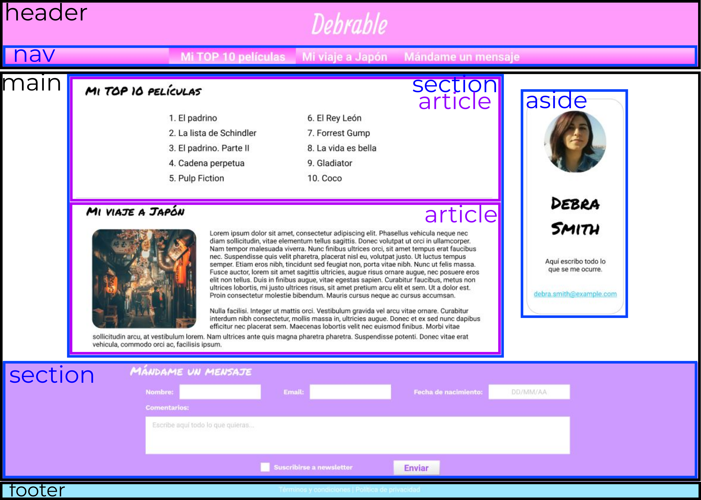
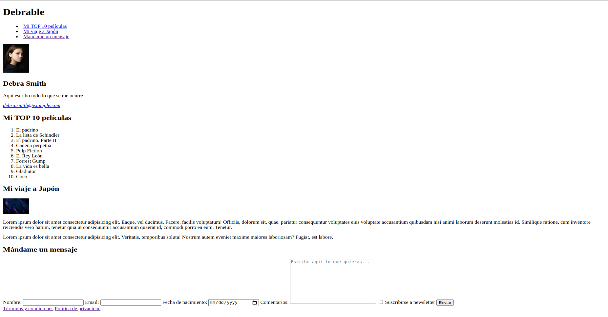

# Estructura HTML

Edita el index.html para crear una estructura como la del ejemplo, siguiendo el esquema:

Los rectángulos de colores representan los distintos niveles de los bloques semánticos: negro > azul > violeta.
Las palabras que representan etiquetas semánticas (header, nav, section, article, aside y footer) están a modo de guía, no deben incluirse. Necesitarás más etiquetas que esas, las indicadas son sólo las que tienen una función meramente semántica.

Requisitos:

- Los labels del formulario deben estar asociados mediante la propiedad _for_.
- El nombre, el email y la fecha de nacimiento son campos obligatorios.
- Las imágenes pueden ser locales o externas, pero deben verse correctamente

Se tendrá en cuenta:

- Las etiquetas usadas
- La estructura

No se tendrá en cuenta:

- El contenido de los textos
- El contenido de las imágenes
- La estética en general

Recuerda que es un ejercicio de HTML, por lo que **debes olvidar la estética final**. Cualquier elemento que incluyas por motivos estéticos, **serán considerados errores**. El resultado debería verse más o menos así, con algunas diferencias dependiendo del navegador (las imágenes se han encogido para facilitar la visión):

Si quieres, puedes añadir el CSS correspondiente a modo de práctica, pero no se valorará. Ten en cuenta además, que está hecho con una herramienta de diseño y no realmente con CSS, por lo que es posible que no consigas el resultado exacto.

El resultado final debe funcionar correctamente ejecutándolo con live server y no dar ningún error en el [Validador de HTML de la W3](https://validator.w3.org/nu/#textarea)
