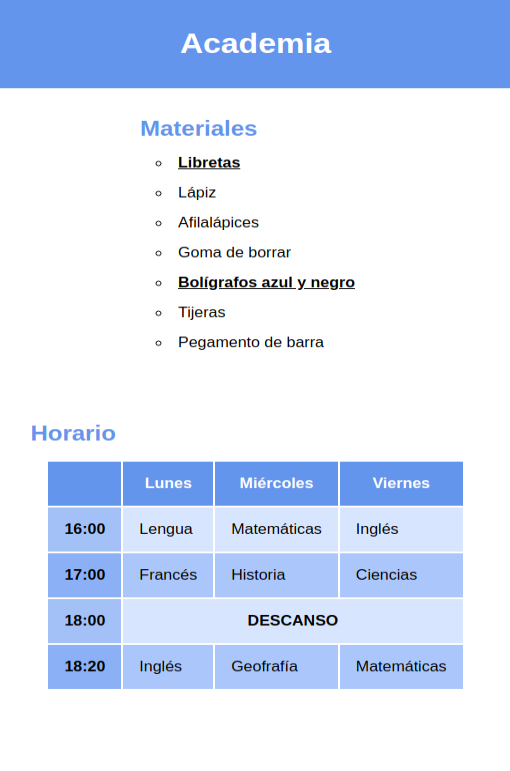
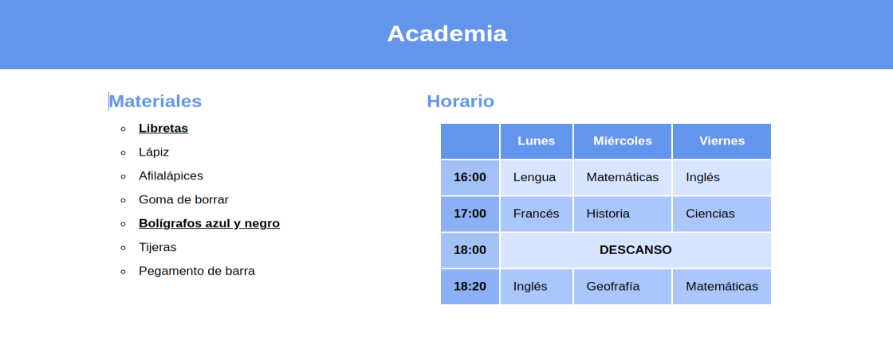
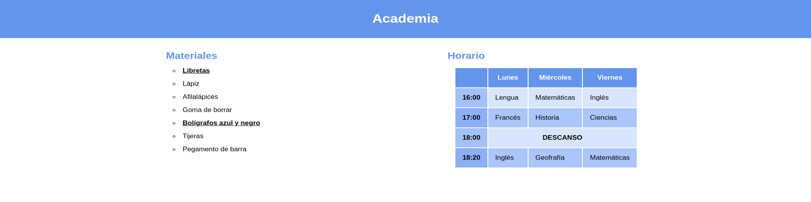

# Selectores

Edita el archivo CSS para dar los estilos necesarios para obtener un resultado como el de la imagen. Utiliza las propiedades de flex necesarias para que el contenido se adapte al tamaño de la pantalla como en los ejemplos:

Se valorará:

- Las propiedades

  - Toda la página tiene una tipografía sin serifa
  - La cabecera tiene color de fondo, y texto blanco y centrado

  - Lista:

    - Las viñetas de la lista no son las que vienen por defecto
    - Los objetos importantes de la lista están subrayados y en negrita

  - Tabla
    - La cabecera tiene un color de fondo y de texto diferente al resto
    - Las filas pares tienen un color de fondo distinto a las impares
    - Los títulos de fila tienen un color de fondo con transparencia
    - El descanso está en mayúsculas, negrita y centrado

- Los selectores:
  - Puedes añadir clases o IDs, pero intenta usar otro tipo de selectores si no están ya en el HTML.
  - En caso de que recurras a clases o IDs, piensa cuál de los dos es el más indicado segun la situación.

No se valorará:

- Los valores (los colores y medidas no tienen por qué ser exactos)

El resultado final debe funcionar correctamente ejecutándolo con live server y no dar ningún error en el [Validador de CSS de la W3](https://jigsaw.w3.org/css-validator/#validate_by_input)
